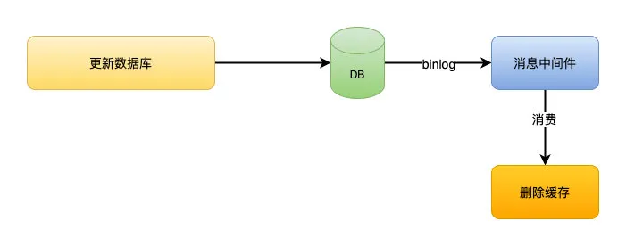

# 缓存一致性

参考链接

[缓存一致性问题](https://mp.weixin.qq.com/s/dYvM8_6SQnYRB6KjPsprbw)

## 问题

先删除缓存，数据库还没有更新成功，此时如果读取缓存，缓存是不存在的，去数据库读取到的旧值，缓存不一致会发生。

## 解决方案

### 延时双删

思路：为了避免更新数据库的时候，其他线程从缓存中读取不到数据，就在更新完数据库之后，再sleep一段时间，然后再次删除缓存。

流程如下：

* 1、线程1删除缓存，然后去更新数据库。
* 2、线程2来读取缓存，发现缓存已经被删除，所以直接从数据库中读取，这时候线程1还没更新完成，所以读到的还是旧值。
* 3、线程1估算时间，sleep，sleep的时间大于线程2读数据+写缓存的时间，所以缓存会被再次删除。
* 4、如果还有其他线程来读取缓存的话，就会再次从数据库中读取到最新值。

### 消息队列

一般大公司都会有监听binlog消息的消息队列存在，为了做一些核对工作。

借助监听binlog的消息队列来做删除缓存的操作，中间件做解耦，保证高可用。

延迟问题依然存在，如果并发不是特别高的话，实时性和一致性可以接受。

### 设置缓存过期时间

对于一致性要求不高的情况，可以考虑采用这种方案。

## 提问题

### 为什么删除，不是更新缓存

举个例子：如果数据库1小时内更新了1000次，那么缓存也要更新1000次，但是这个缓存可能在1小时内只被读取了1次，那么这1000次的更新有必要吗？

反过来，如果是删除的话，就算数据库更新了1000次，那么也只是做了1次缓存删除，只有当缓存真正被读取的时候才去数据库加载。

